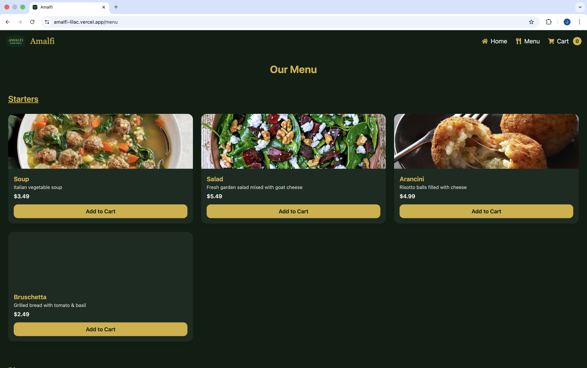
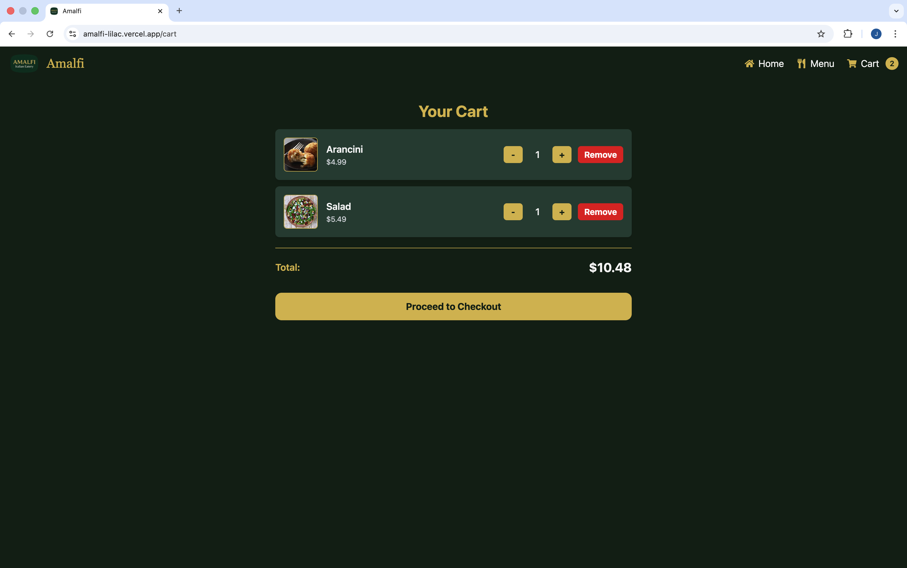
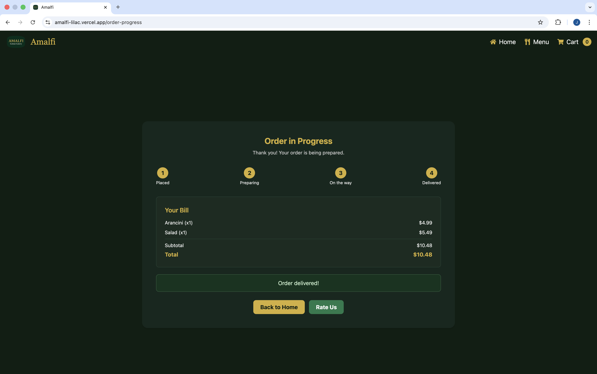
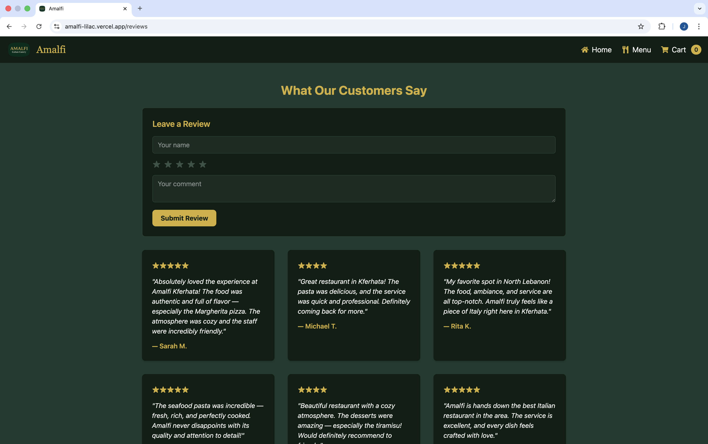
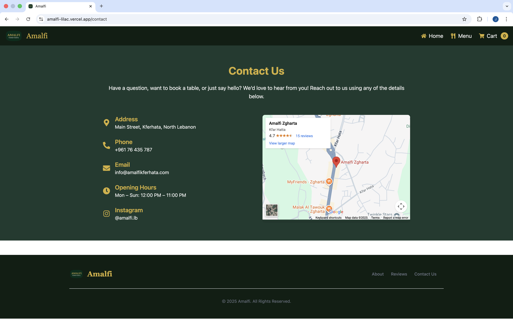
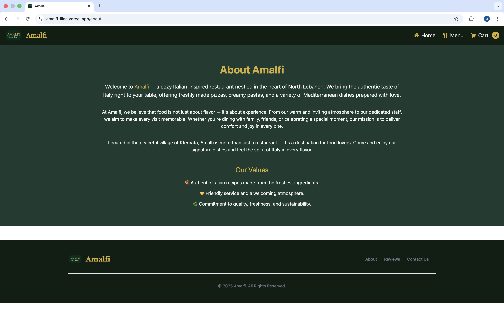

# Amalfi — Italian Restaurant React App

Welcome to Amalfi, a restaurant application built with React and Vite. Amalfi lets customers view a delicious Italian menu, add items to their cart, review and place orders, and track the progress of orders in real time.

## Features

- **Menu Display:** Browse a selection of Italian meals and drinks.
- **Add to Cart:** Add favorite dishes to your shopping cart.
- **Order Review:** Review selected items before placing an order.
- **Place Order:** Submit an order for processing.
- **Order Progress:** Monitor the status and progress of your placed order.

## Getting Started

### Prerequisites

- npm (v9+ recommended) or yarn

### Installation

```bash
git clone https://github.com/JpTamer/FirstReactProject.git
cd FirstReactProject
npm install
```

### Running Locally (Vite)

```bash
npm run dev
```

Then open the URL printed in the terminal, usually [http://localhost:5173](http://localhost:5173).

## Usage

1. **Explore the Menu:** Browse Italian specialties.
2. **Add to Cart:** Click to add items.
3. **Review & Place Order:** Review selections and confirm your order.
4. **Track Progress:** Watch your order being prepared and delivered.

## Technologies Used

- React
- Vite
- JavaScript (ES6+)
- Tailwind CSS — Utility-first CSS framework for rapid UI development
- (Add any other libraries such as React Router, state management, etc.)

### Tailwind CSS Setup

This project uses [Tailwind CSS](https://tailwindcss.com/) for styling. Tailwind is already installed and configured via `tailwind.config.js` and imported in `src/index.css`. You can customize your design by editing utility classes in your components.

To learn more about customizing Tailwind, visit their [documentation](https://tailwindcss.com/docs/installation).

## Deployment

This project is deployed at: https://amalfi-lilac.vercel.app

To deploy your own version, you can use services like Vercel, Netlify, or any static hosting that supports Vite builds.

## Contribution

Pull requests are welcome. For major changes, please open an issue first to discuss what you would like to change.

## License

This project is currently unlicensed. Feel free to add a LICENSE file (e.g., MIT) if you want to specify usage terms.

## Screenshots

### Home Page


### Menu View


### Cart View


### Order Progress


### Reviews Page


### Contact us Page


### About us Page



